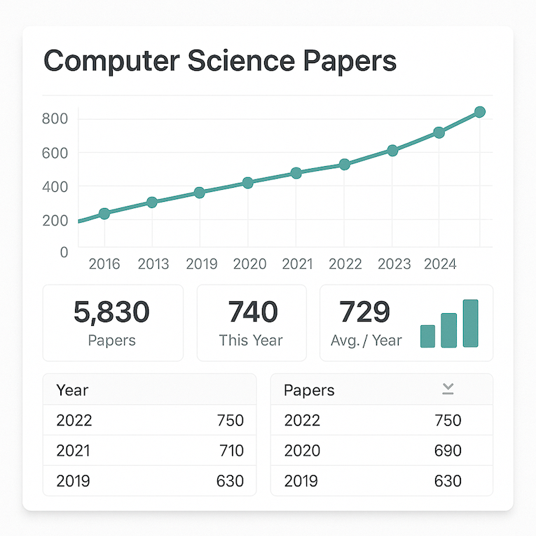

## Description
This project aims to design a dashboard that tracks the progression and themes of academic papers on computer science over time. The main deliverable is a web scraping tool that pulls keywords from academic papers, considering the popularity of the paper and its publication. The data will be stored in an appropriate database and displayed in a web browser format, allowing users to visualize trends and changes in research focus over time. This project will provide practical experience in using APIs, web scraping, and data analysis. Some academic search engines to consider are Google Scholar, [BASE](https://www.base-search.net/), [Core](https://core.ac.uk/) and [Science.gov](https://science.gov/)

The final output will be a functional dashboard that presents the data in an intuitive and interactive manner.

## Hardware, Software and Compentency Requirements

- Software: Intermediate understand of a scripting programming language (e.g., Python, JavaScript), web development and statistics.
- Hardware: Access to a computer with internet connectivity

To scrape specific journal websites, you may need to obtain explicit permission from the website administrators or owners.

## Resources to get started

You are free to choose your own implementation details. The resouces below are examples to get started. 

- Software Libraries: Example libraries for web scraping are [BeautifulSoup](https://pypi.org/project/beautifulsoup4/), Selenium. Flask/Django for the dashboard and Pandas for the data aggregation. 
- Databases: Relational Databases (e.g. [MariaDB](https://learn.arm.com/learning-paths/servers-and-cloud-computing/mariadb/))
- Textbooks: "Web Scraping with Python" by Ryan Mitchell, "Data Science from Scratch" by Joel Grus

## Previous Submissions

## Benefits 

1. Standout projects could be internally referred for relevant positions at Arm! :page_with_curl:

2. If your submission is approved, you will receive a recognised badge that you can list on your CV and shared on LinkedIn. A great way to stand out from the crowd! :mortar_board:

3. It's a great way to demonstrate your initiative and commitment to your field. 

4. It offers the opportunity to learn valuable skills that are highly relevant to a successful career at Arm!  :tada: