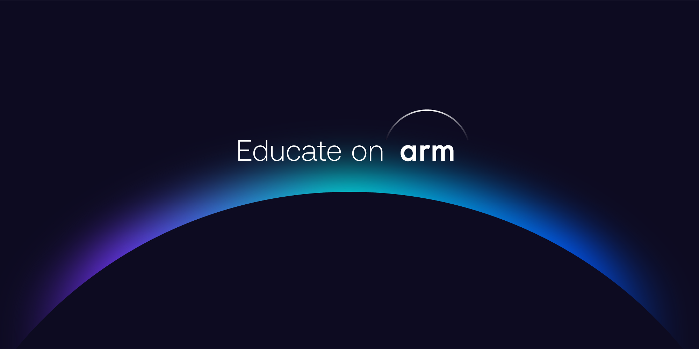

## Description
This project trains and deploys an optimised and TOSA-compliant AI model on an Arm Cortex-/M55/U85 combination to create a low-power ambient/always-on AI platform capable of detecting environmental changes. This low-power system reacts to its environment and "wakes" a Arm Cortex-A device to perform high-performance processing, such as using a more substantial Edge AI LLM performing inference leveraging NEON. The project should quantify accuracy, latency, and power consumption.

You can choose an appropriate application - one example would be an ambient smart home assistant capable of recognizing a wake-word, e.g, "Hey Arm". After the wake-word is detected, it can utilise an LLM to understand and respond to questions - e.g, "Where is Arm's Global HQ?". The device will be able to control peripheral devices accordingly. Please feel free to explore different use-cases - perhaps a camera or temperature sensor or IMU is used for environmental sensing, what would the Cortex-A device do?

The deliverables include a functional Edge AI prototype consisting of a CPU inference use-case triggered by an always-on low-power AI model accelerated on Arm NPU, along with documentation detailing the development process and the performance of the system.

## Prequisites

- Languages: Python, C++, Embedded C
- Tooling: Tensorflow Lite or ExecuTorch, TensorFlow Lite for Microcontrollers, Keil MDK, Yocto/Linux, Bare-metal or RTOS, Vela Compiler
- Hardware: Cortex-A, Cortex-M55, Ethos-U85 Development Board. Alif Ensemble Development Kit E6/E8 variants include all three types of core.

## Resources from Arm and our partners

- Learning paths: [Navigating Machine Learning with Ethos-U processors](https://learn.arm.com/learning-paths/microcontrollers/nav-mlek/)
- Learning paths: [Tutorials on CMSIS](https://learn.arm.com/tag/cmsis/)
- Install Guide: [Keil Studio for VSCode](https://learn.arm.com/install-guides/keilstudio_vs/)
- Book: ["A beginner's Guide to Designing Embedded System Applications on Arm Cortex-M Microcontrollers"](https://www.arm.com/resources/education/books)
- Book: ["Arm Helium Technology M-Profile Vector Extensions (MVE)"](https://www.arm.com/resources/education/books)

## Support Level

This project is designed to be self-serve but comes with opportunity of some community support from Arm Ambassadors, who are part of the Arm Developer program. If you are not already part of our program, [click here to join](https://www.arm.com/resources/developer-program?#register).

## Benefits 

Standout project contributions will result in digital badges for CV building, recognised by Arm Talent Acquisition. We are currently discussing with national agencies the potential for funding streams for Arm Developer Labs projects, which would flow to you, not us.

To receive the benefits, you must show us your project through our [online form](https://forms.office.com/e/VZnJQLeRhD). Please do not include any confidential information in your contribution. Additionally if you are affiliated with an academic institution, please ensure you have the right to share your material.
