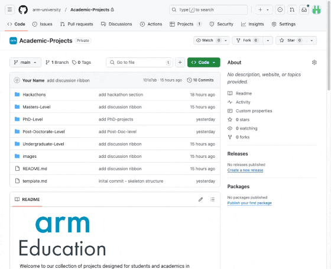

# Arm Developer Labs


Welcome to our collection of industry-focused software challenges. This repository features a diverse set of problems designed for students and developers alike. If you're looking to work at Arm, explore financially-sponsored challenges or learn new skills - this is your opportunity! 

Exceptional solutions will be internally referred for relevant jobs at Arm. Take part, showcase your skills, and help drive innovation across the Arm ecosystem!


## [Developer Labs Repository](https://github.com/arm-university/Arm-Developer-Labs)

## Why Participate?

1. Standout projects could be internally referred for relevant positions at Arm! :page_with_curl:

2. If your submission is approved, you may receive a recognised badge that you can list on your CV and shared on LinkedIn. A great way to stand out from the crowd! :mortar_board:

3. It's a great way to demonstrate your initiative and commitment to your field. 

4. It offers the opportunity to learn valuable skills that are highly relevant to a successful career at Arm!  :tada:

Give it a try and see how it can boost your academic and professional journey.

## Explore Arm-based Projects!

The following infographic details the directory structure and where to find example projects!

```bash
Project-Ideas
├── Projects                            # Design Contests and Hackathons
│   └── Projects                        # Projects with different levels
├── Research                
│   └── Extended-Team-Projects          # Team Research Projects 
│   └── Short-term-Research-Projects    # Short Research Projects           
├── README.md
├── images                              # Images
└── template.md                         # Template to suggest a project
```
## Previous Examples

1. Carnegie Mellon Cloudlet Collaboration

<iframe width="560" height="315" src="https://www.youtube.com/embed/zaRozkrcix0?si=eRZirXrv5300fnBc" title="YouTube video player" frameborder="0" allow="accelerometer; autoplay; clipboard-write; encrypted-media; gyroscope; picture-in-picture; web-share" referrerpolicy="strict-origin-when-cross-origin" allowfullscreen></iframe>


## How to Participate

1. Read the project details clearly and select one that you're most interested in
2. If you’re interested in joining Arm, visit the [Early Career FAQ page](https://careers.arm.com/Early-Careers-FAQ) and make sure you have the legal right to work in the location of the role you’re interested in.

For Arm-specific technical support and mentorship, sign up for free to the [Arm Developer program](https://www.arm.com/resources/developer-program?#register). Access to technical support and mentorship is available through our discord channel!

## How to submit your project

To receive recognition for your efforts.

1. **Fork this repository** and edit the `README.md` file in the `/Projects/Previous_Submissions` folder. As a minimum you must include a title, author(s) and a link to your source code. 

Please do not include any confidential information in your contribution. This includes confidential software or unannounced product information. If you are a student, please also clarify with your academic institution what content you are permitted to share.

2. **Post a link to your project on the `#developer-labs` discord channel** (sign up to the developer progam [here](https://www.arm.com/resources/developer-program?#register)). The post should include a short description and/or a screenshot with the `#developerchallenge` tag. 

## How to Suggest Projects

If you've been working on an Arm-based project or have a suggestion for a project or hackathon. Click on the discussion section of this repository, fill out the `template.md` file and open a discussion (see GIF below for instructions).



Someone from Arm education will be in contact to discuss how we can support. 

## Technical Support and Supervision

For community driven support we have the [Arm developer program](https://www.arm.com/resources/developer-program), including discord channels where you have access to Arm experts and fellow arm developers. 

For projects on system-on-chip design, please reach out to [SoC labs](https://soclabs.org/) for community driven SoC design support

## Licensing

We aim to work closely with the University to ensure that the IP rights are managed in a way that benefits both parties and promotes the dissemination of knowledge. Please refer to the specific licensing terms outlined in each project's documentation for detailed information.

We are committed to fostering collaboration with universities on intellectual property (IP) rights for the content produced through our academic projects. Each project may have different licensing terms, tailored to suit the specific needs and goals of the collaboration. For instance, our current learning path tutorial is licensed under Creative Commons Attribution-ShareAlike 4.0 International (CC BY-SA 4.0).
